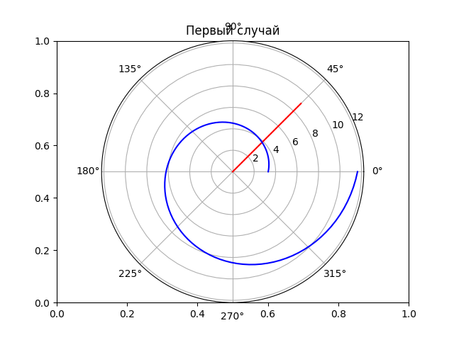

---
## Front matter
lang: ru-RU
title: Лабораторная №1
subtitle: Задача о погоне
author: |
	Николай Игнатьев\inst{1}
institute: |
	\inst{1}RUDN University, Moscow, Russian Federation
date: 28 апреля 2021 года

## Formatting
toc: false
slide_level: 2
theme: metropolis
header-includes: 
 - \metroset{progressbar=frametitle,sectionpage=progressbar,numbering=fraction}
 - '\makeatletter'
 - '\beamer@ignorenonframefalse'
 - '\makeatother'
aspectratio: 43
section-titles: true
sansfont: PT Serif
---

## Цель работы

В ходе работы изучается задача о погоне. Для этого выводятся необходимые дифференциальные уравнения и реализуется 
программа расчёта траектории для заданных значений.

## Задание

1. Провести рассуждения и вывод дифференциальных уравнений, если скорость катера больше скорости лодки в 5.1 раза, расстояние между ними 20.2 км.
1. Построить траекторию движения катера и лодки для двух случаев.
1. Определить по графику точку пересечения катера и лодки.

## Рисунок

## Расчёты
$$ \frac{x}{v} = \frac{k - x}{5.1v} $$
$$ \frac{x}{v} = \frac{k + x}{5.1v} $$
$$x_1 = \frac{k}{6.1}$$
$$x_2 = \frac{k}{4.1}$$
$$ v_\tau = \sqrt{5.1^2v^2 - v^2} = \sqrt{25.01}v$$
$$\frac{dr}{d\theta} = \frac{r}{\sqrt{25.01}}$$

## Первый случай

## Второй случай

## Выводы
В ходе работы была рассмотрена модель погони, выведены дифференциальные уравнения для конкретной задачи, написана 
программа для построения графиков погони. По графикам были определены точки в которых произойдёт встреча катера и лодки.
