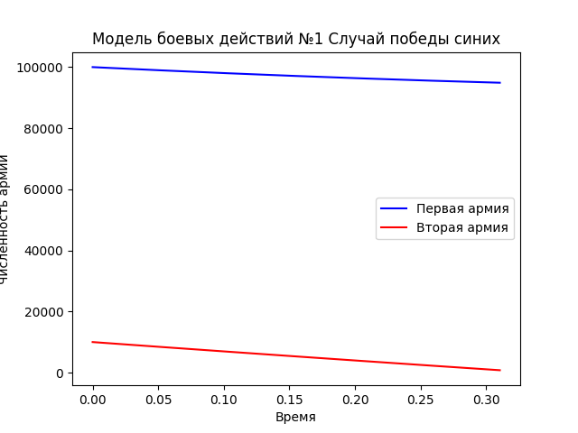
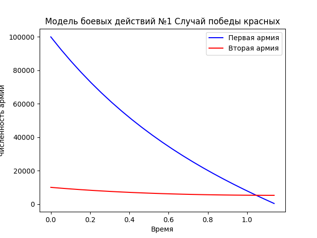
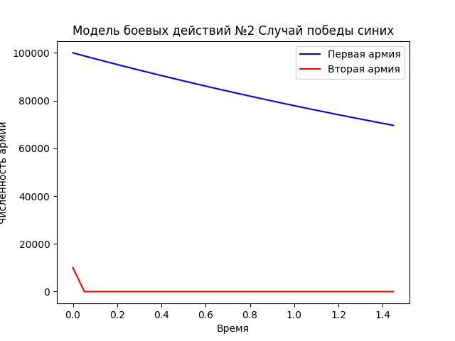
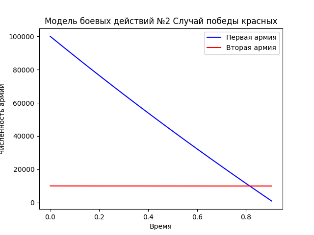

---
## Front matter
lang: ru-RU
title: Лабораторная работа №2
subtitle: Модель боевых действий
author: |
	Николай Игнатьев\inst{1}
institute: |
	\inst{1}RUDN University, Moscow, Russian Federation
date: 28 апреля 2021 года

## Formatting
toc: false
slide_level: 2
theme: metropolis
header-includes: 
 - \metroset{progressbar=frametitle,sectionpage=progressbar,numbering=fraction}
 - '\makeatletter'
 - '\beamer@ignorenonframefalse'
 - '\makeatother'
aspectratio: 43
section-titles: true
sansfont: PT Serif
---

## Описание работы
В ходе работы были построены несколько моделей ведения боевых действий, проанализированы соответствующие графики и предложены
конфигурационные коэффициенты системы меняющие победителей.

## Модель 1. Без партизан.
$$\frac{dx}{dt}=-0.12x(t)-0.9y(t)+|sin(t)|$$
$$\frac{dy}{dt}=-0.3x(t)-0.1y(t)+|cos(t)|$$
{ #fig:001 width=70% }

## Модель 2. Без партизан.
$$\frac{dx}{dt}=-0.5x(t)-10y(t)+|sin(t)|$$
$$\frac{dy}{dt}=-0.1x(t)-0.01y(t)+|cos(t)|$$
{ #fig:001 width=70% }

## Модель 3. С партизанами.
$$\frac{dx}{dt}=-0.25x(t)-0.96y(t)+sin(2t)+1$$
$$\frac{dy}{dt}=-0.25x(t)y(t)-0.3y(t)+cos(20t)+1$$
{ #fig:001 width=70% }

## Модель 4. С партизанами.
$$\frac{dx}{dt}=-0.2x(t)-10y(t)+sin(2t)+1$$
$$\frac{dy}{dt}=-0.0000001x(t)y(t)-0.0000001y(t)+cos(20t)+1$$
{ #fig:001 width=70% }
