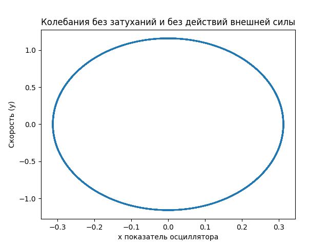

---
## Front matter
lang: ru-RU
title: Лабораторная №3
subtitle: Модель гармонических колебаний
author: |
	Николай Игнатьев\inst{1}
institute: |
	\inst{1}RUDN University, Moscow, Russian Federation
date: 28 апреля 2021 года

## Formatting
toc: false
slide_level: 2
theme: metropolis
header-includes: 
 - \metroset{progressbar=frametitle,sectionpage=progressbar,numbering=fraction}
 - '\makeatletter'
 - '\beamer@ignorenonframefalse'
 - '\makeatother'
aspectratio: 43
section-titles: true
sansfont: PT Serif
---

## Цель работы
Изучить решения уравнения гармонического осциллятора. Рассмотреть случаи с затуханиями и воздействиями внешних сил.

## Задание
1. Построить решение уравнения гармонического осциллятора без затухания
1. Записать уравнение свободных колебаний гармонического осциллятора с
затуханием, построить его решение. Построить фазовый портрет гармонических
колебаний с затуханием.
1. Записать уравнение колебаний гармонического осциллятора, если на систему
действует внешняя сила, построить его решение. Построить фазовый портрет
колебаний с действием внешней силы.

## Общая модель гармонического осциллятора
$$\ddot x + 2 \gamma \dot x + \omega_{0}^2 x = 0$$

## Колебания гармонического осциллятора без затуханий и без действий внешней силы
$$\ddot x + 3.7 \dot x = 0$$
{ #fig:001 width=70% }

## Колебания гармонического осциллятора c затуханием и без действий внешней силы
$$\ddot x + 3 \dot x + 10 x = 0$$
{ #fig:001 width=70% }

## Колебания гармонического осциллятора c затуханием и под действием внешней силы
{ #fig:001 width=70% }

