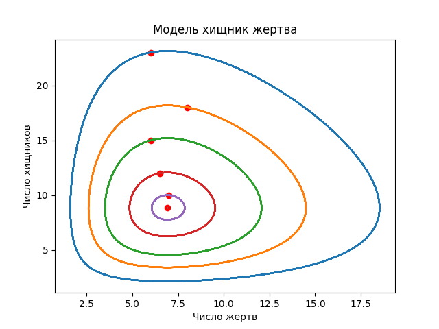
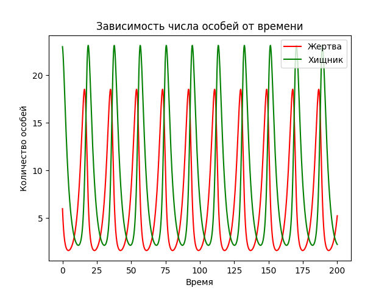

---
## Front matter
lang: ru-RU
title: Лабораторная №4
subtitle: Модель хищник-жертва
author: |
	Николай Игнатьев\inst{1}
institute: |
	\inst{1}RUDN University, Moscow, Russian Federation
date: 28 апреля 2021 года

## Formatting
toc: false
slide_level: 2
theme: metropolis
header-includes: 
 - \metroset{progressbar=frametitle,sectionpage=progressbar,numbering=fraction}
 - '\makeatletter'
 - '\beamer@ignorenonframefalse'
 - '\makeatother'
aspectratio: 43
section-titles: true
sansfont: PT Serif
---

## Задание
Для модели «хищник-жертва»:
$$ \frac{dx}{dt} = -0.38x(t) + 0.043x(t)y(t) $$
$$ \frac{dy}{dt} = 0.36y(t) - 0.052x(t)y(t) $$
$$ x_0 = 6 $$
$$ y_0 = 23 $$
Построить график зависимости численности хищников от численности жертв, а также графики изменения численности хищников и
численности жертв при начальных условиях. Найти стационарное состояние системы.

## Модель хищник-жертва
{ #fig:001 width=70% }

## Зависимость количества особей от времени
{ #fig:002 width=70% }
