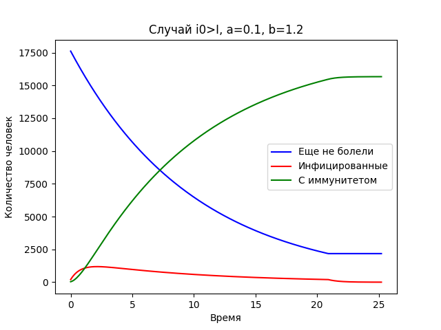

---
## Front matter
lang: ru-RU
title: Лабораторная №5
subtitle: Задача об эпидемии
author: |
	Николай Игнатьев\inst{1}
institute: |
	\inst{1}RUDN University, Moscow, Russian Federation
date: 28 апреля 2021 года

## Formatting
toc: false
slide_level: 2
theme: metropolis
header-includes: 
 - \metroset{progressbar=frametitle,sectionpage=progressbar,numbering=fraction}
 - '\makeatletter'
 - '\beamer@ignorenonframefalse'
 - '\makeatother'
aspectratio: 43
section-titles: true
sansfont: PT Serif
---

## Постановка задачи
Смоделировать "эпидемию со следующими значениями":

- Число жителей(N) = 17854
- Число заболевших в самом начале(I(0)) = 199
- Число людей с иммунитетом в самом начале(R(0)) = 35

Придумать коэффициенты, и изучить поведение модели при I(0) > I* и в противном случае.

## Модель
$$ \frac{dS}{dt} = \begin{cases}
	-aS, & I(t) > I^{*}\\
	0, & I(t) \leq I^{*}
\end{cases}$$ 
$$ \frac{dI}{dt} = \begin{cases}
	aS - bI, & I(t) > I^{*}\\
	-bI, & I(t) \leq I^{*}
\end{cases}$$ 
$$ \frac{dR}{dt} = b * I $$

## Случай когда никто не заболевает
{ #fig:001 width=70% }

## Случай когда заболевают все
{ #fig:002 width=70% }

## Случай когда заболевает только часть
{ #fig:003 width=70% }
