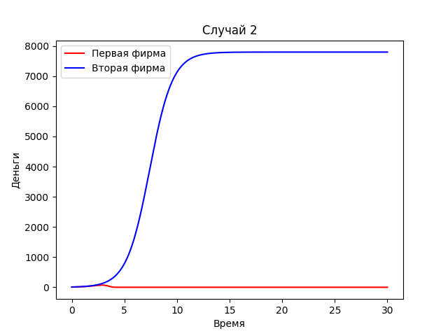

---
## Front matter
lang: ru-RU
title: Лабораторная №7
subtitle: Модель конкуренции двух фирм
author: |
	Николай Игнатьев\inst{1}
institute: |
	\inst{1}RUDN University, Moscow, Russian Federation
date: 28 апреля 2021 года

## Formatting
toc: false
slide_level: 2
theme: metropolis
header-includes: 
 - \metroset{progressbar=frametitle,sectionpage=progressbar,numbering=fraction}
 - '\makeatletter'
 - '\beamer@ignorenonframefalse'
 - '\makeatother'
aspectratio: 43
section-titles: true
sansfont: PT Serif
---

## Цель работы
Изучить модели изменения средств фирм без учета постоянных издержек и с введенной нормировкой. Построить графики

## Первая модель
$$\frac{dM_1}{d\theta}=M_1 - \frac{b}{c_1} M_1 M_2 - \frac{a_1}{c_1} M_1^2$$
$$\frac{dM_2}{d\theta}= \frac{c_2}{c_1}M_2 - \frac{b}{c_1} M_1 M_2 - \frac{a_2}{c_1} M_2^2$$

## Первая модель
{ #fig:001 width=70% }

## Вторая модель
$$\frac{dM_1}{d\theta}=M_1 - (\frac{b}{c_1} + 0,00047) M_1 M_2 - \frac{a_1}{c_1} M_1^2$$
$$\frac{dM_2}{d\theta}= \frac{c_2}{c_1}M_2 - \frac{b}{c_1} M_1 M_2 - \frac{a_2}{c_1} M_2^2$$

## Вторая модель
{ #fig:002 width=70% }
