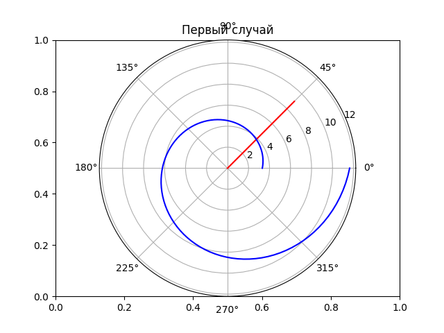
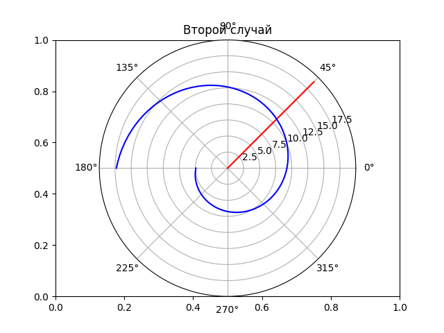

---
# Front matter
lang: ru-RU
title: "Лабораторная №1"
subtitle: "Задача о погоне"
author: "Игнатьев Николай"

# Formatting
toc-title: "Содержание"
toc: true # Table of contents
toc_depth: 2
lof: false # List of figures
lot: false # List of tables
fontsize: 12pt
linestretch: 1.5
papersize: a4paper
documentclass: scrreprt
polyglossia-lang: russian
polyglossia-otherlangs: english
mainfont: PT Serif
romanfont: PT Serif
sansfont: PT Sans
monofont: PT Mono
mainfontoptions: Ligatures=TeX
romanfontoptions: Ligatures=TeX
sansfontoptions: Ligatures=TeX,Scale=MatchLowercase
monofontoptions: Scale=MatchLowercase
indent: true
pdf-engine: lualatex
header-includes:
  - \linepenalty=10 # the penalty added to the badness of each line within a paragraph (no associated penalty node) Increasing the value makes tex try to have fewer lines in the paragraph.
  - \interlinepenalty=0 # value of the penalty (node) added after each line of a paragraph.
  - \hyphenpenalty=50 # the penalty for line breaking at an automatically inserted hyphen
  - \exhyphenpenalty=50 # the penalty for line breaking at an explicit hyphen
  - \binoppenalty=700 # the penalty for breaking a line at a binary operator
  - \relpenalty=500 # the penalty for breaking a line at a relation
  - \clubpenalty=150 # extra penalty for breaking after first line of a paragraph
  - \widowpenalty=150 # extra penalty for breaking before last line of a paragraph
  - \displaywidowpenalty=50 # extra penalty for breaking before last line before a display math
  - \brokenpenalty=100 # extra penalty for page breaking after a hyphenated line
  - \predisplaypenalty=10000 # penalty for breaking before a display
  - \postdisplaypenalty=0 # penalty for breaking after a display
  - \floatingpenalty = 20000 # penalty for splitting an insertion (can only be split footnote in standard LaTeX)
  - \raggedbottom # or \flushbottom
  - \usepackage{float} # keep figures where there are in the text
  - \floatplacement{figure}{H} # keep figures where there are in the text
---

# Цель работы

В ходе работы изучается задача о погоне. Для этого выводятся необходимые дифференциальные уравнения и реализуется 
программа расчёта траектории для заданных значений.

# Задание

1. Провести рассуждения и вывод дифференциальных уравнений, если скорость катера больше скорости лодки в 5.1 раза, расстояние между ними 20.2 км.
1. Построить траекторию движения катера и лодки для двух случаев.
1. Определить по графику точку пересечения катера и лодки.

# Выполнение лабораторной работы

Катер находится на расстоянии 20.2 км (пока k). Значит, что после прямолинейного движения катер будет в точке в первом случае: $$ \frac{x}{v} = \frac{k - x}{5.1v} $$ и во втром случае: $$ \frac{x}{v} = \frac{k + x}{5.1v} $$ Отсюда получаем $x_1 = \frac{k}{6.1}$ и $x_2 = \frac{k}{4.1}$

Тангенциальная скорость: $$ v_\tau = \sqrt{5.1^2v^2 - v^2} = \sqrt{25.01}v$$

Переходим к дифференциальному уравнению: $$\frac{dr}{d\theta} = \frac{r}{\sqrt{25.01}}$$

Была написана программа, которая вычисляет траекторию по этому уравнению. Траектория расчитывалась для двух начальных условий.

$$\theta_1 = 0$$ $$x_1 = k / 6.1$$ В этом случае катер догоняет лодку на четвёртом километре пути.
{ #fig:001 width=70% }
$$\theta_2 = -pi$$ $$x_2 = k / 4.1 $$ В этом случае катер догоняет лодку рядом с восьмым километром.
{ #fig:001 width=70% }

# Выводы

В ходе работы была рассмотрена модель погони, выведены дифференциальные уравнения для конкретной задачи, написана 
программа для построения графиков погони. По графикам были определены точки в которых произойдёт встреча катера и лодки.
