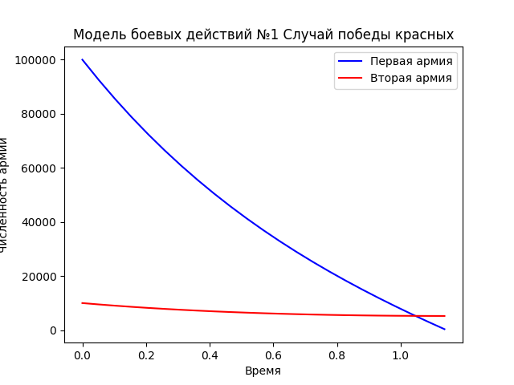
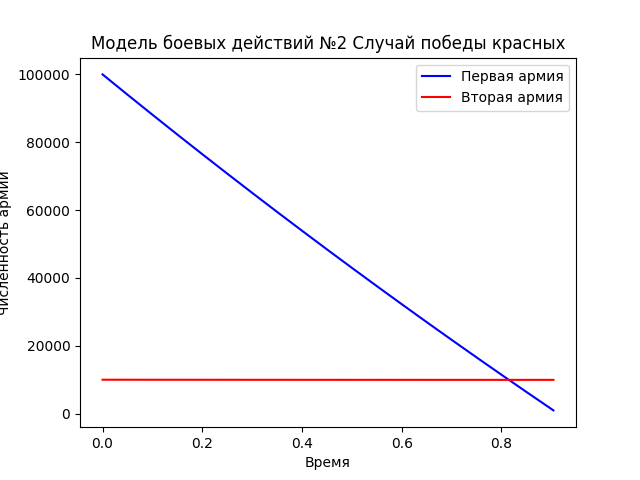

---
# Front matter
lang: ru-RU
title: "Лабораторная №2"
subtitle: "Модель боевых действий"
author: "Игнатьев Николай"

# Formatting
toc-title: "Содержание"
toc: true # Table of contents
toc_depth: 2
lof: false # List of figures
lot: false # List of tables
fontsize: 12pt
linestretch: 1.5
papersize: a4paper
documentclass: scrreprt
polyglossia-lang: russian
polyglossia-otherlangs: english
mainfont: PT Serif
romanfont: PT Serif
sansfont: PT Sans
monofont: PT Mono
mainfontoptions: Ligatures=TeX
romanfontoptions: Ligatures=TeX
sansfontoptions: Ligatures=TeX,Scale=MatchLowercase
monofontoptions: Scale=MatchLowercase
indent: true
pdf-engine: lualatex
header-includes:
  - \linepenalty=10 # the penalty added to the badness of each line within a paragraph (no associated penalty node) Increasing the value makes tex try to have fewer lines in the paragraph.
  - \interlinepenalty=0 # value of the penalty (node) added after each line of a paragraph.
  - \hyphenpenalty=50 # the penalty for line breaking at an automatically inserted hyphen
  - \exhyphenpenalty=50 # the penalty for line breaking at an explicit hyphen
  - \binoppenalty=700 # the penalty for breaking a line at a binary operator
  - \relpenalty=500 # the penalty for breaking a line at a relation
  - \clubpenalty=150 # extra penalty for breaking after first line of a paragraph
  - \widowpenalty=150 # extra penalty for breaking before last line of a paragraph
  - \displaywidowpenalty=50 # extra penalty for breaking before last line before a display math
  - \brokenpenalty=100 # extra penalty for page breaking after a hyphenated line
  - \predisplaypenalty=10000 # penalty for breaking before a display
  - \postdisplaypenalty=0 # penalty for breaking after a display
  - \floatingpenalty = 20000 # penalty for splitting an insertion (can only be split footnote in standard LaTeX)
  - \raggedbottom # or \flushbottom
  - \usepackage{float} # keep figures where there are in the text
  - \floatplacement{figure}{H} # keep figures where there are in the text
---

# Цель работы
Рассмотреть несколько моделей боевых действий. 

# Задание
Между страной Х и страной У идет война. Численность состава войск
исчисляется от начала войны, и являются временными функциями x(t)
и y(t). В начальный момент времени страна Х имеет армию численностью 100 000 человек,
а в распоряжении страны У армия численностью в 10 000 человек. Для упрощения
модели считаем, что коэффициенты a, b, c, h постоянны. Также считаем P(t) и Q(t) непрерывные функции. Построить графики
изменения численности войск армии Х и армии У для следующих случаев:
1. Модель боевых действий между регулярными войсками.
$$\frac{dx}{dt}=-0.12x(t)-0.9y(t)+|sin(t)|$$
$$\frac{dy}{dt}=-0.3x(t)-0.1y(t)+|cos(t)|$$
1. Модель ведение боевых действий с участием регулярных войск и
партизанских отрядов.
   $$\frac{dx}{dt}=-0.25x(t)-0.96y(t)+sin(2t)+1$$
   $$\frac{dy}{dt}=-0.25x(t)y(t)-0.3y(t)+cos(20t)+1$$
   
# Выполнение лабораторной работы
В первом случае первая армия побеждает. Относительно высокого(0.95) коэффициента эффективности второй армии недостаточно,
чтобы нивелировать 10-кратную разницу количества солдат. 
{ #fig:001 width=70% }
Победы второго войска удаётся достичь сильно увеличив коэффициент эффективности второй армии, понизив негативные 
коэффициенты для неё, а также увеличив естественное уменьшение первой армии.
$$\frac{dx}{dt}=-0.5x(t)-10y(t)+|sin(t)|$$
$$\frac{dy}{dt}=-0.1x(t)-0.01y(t)+|cos(t)|$$
{ #fig:001 width=70% }
В модели с партизанами уменьшение второго войска проходит ещё более скоро ввиду добавочного множителя. 
{ #fig:001 width=70% }
Добиться победы второго войска получается только уменьшая негативные коэффициенты практически до нуля.
$$\frac{dx}{dt}=-0.2x(t)-10y(t)+sin(2t)+1$$
$$\frac{dy}{dt}=-0.0000001x(t)y(t)-0.0000001y(t)+cos(20t)+1$$
{ #fig:001 width=70% }

# Выводы
Были построены несколько моделей ведения боевых действий, проанализированы соответствующие графики и предложены
конфигурационные коэффициенты системы меняющие победителей.
