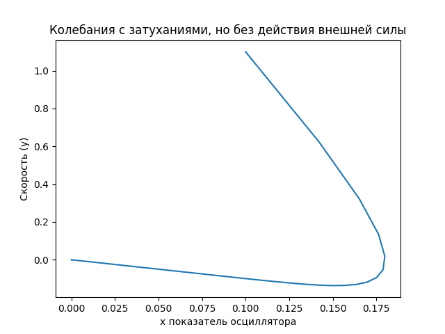

---
# Front matter
lang: ru-RU
title: "Лабораторная №3"
subtitle: "Модель гармонических колебаний"
author: "Игнатьев Николай"

# Formatting
toc-title: "Содержание"
toc: true # Table of contents
toc_depth: 2
lof: false # List of figures
lot: false # List of tables
fontsize: 12pt
linestretch: 1.5
papersize: a4paper
documentclass: scrreprt
polyglossia-lang: russian
polyglossia-otherlangs: english
mainfont: PT Serif
romanfont: PT Serif
sansfont: PT Sans
monofont: PT Mono
mainfontoptions: Ligatures=TeX
romanfontoptions: Ligatures=TeX
sansfontoptions: Ligatures=TeX,Scale=MatchLowercase
monofontoptions: Scale=MatchLowercase
indent: true
pdf-engine: lualatex
header-includes:
  - \linepenalty=10 # the penalty added to the badness of each line within a paragraph (no associated penalty node) Increasing the value makes tex try to have fewer lines in the paragraph.
  - \interlinepenalty=0 # value of the penalty (node) added after each line of a paragraph.
  - \hyphenpenalty=50 # the penalty for line breaking at an automatically inserted hyphen
  - \exhyphenpenalty=50 # the penalty for line breaking at an explicit hyphen
  - \binoppenalty=700 # the penalty for breaking a line at a binary operator
  - \relpenalty=500 # the penalty for breaking a line at a relation
  - \clubpenalty=150 # extra penalty for breaking after first line of a paragraph
  - \widowpenalty=150 # extra penalty for breaking before last line of a paragraph
  - \displaywidowpenalty=50 # extra penalty for breaking before last line before a display math
  - \brokenpenalty=100 # extra penalty for page breaking after a hyphenated line
  - \predisplaypenalty=10000 # penalty for breaking before a display
  - \postdisplaypenalty=0 # penalty for breaking after a display
  - \floatingpenalty = 20000 # penalty for splitting an insertion (can only be split footnote in standard LaTeX)
  - \raggedbottom # or \flushbottom
  - \usepackage{float} # keep figures where there are in the text
  - \floatplacement{figure}{H} # keep figures where there are in the text
---

# Цель работы
Изучить решения уравнения гармонического осциллятора. Рассмотреть случаи с затуханиями и воздействиями внешних сил.

# Задание
1. Построить решение уравнения гармонического осциллятора без затухания.
1. Записать уравнение свободных колебаний гармонического осциллятора с
затуханием, построить его решение. Построить фазовый портрет гармонических
колебаний с затуханием.
1. Записать уравнение колебаний гармонического осциллятора, если на систему
действует внешняя сила, построить его решение. Построить фазовый портрет
колебаний с действием внешней силы.

# Выполнение лабораторной работы
Рассмотрим колебания гармонического осциллятора без затуханий и без действий внешней силы, описываемые уравнением: 

$$ \ddot x + 3.7 \dot x = 0 $$

Фазовое пространство таких колебаний является эллипсом. 

Если рассматривать также затухания, то график таких колебаний будет являться не замкнутой кривой.

$$ \ddot x  + 3 \dot x + 10x = 0 $$

Введём также воздействие дополнительных сил.

$$ \ddot x + 3 \dot x  + 11x = 0.9sin(0.9t) $$

График такого колебания будет содержать в себе два предыдущих

# Ответы на вопросы

1. Простейшая модель гармонического осциллятора описывается так:
   $$ \ddot x + \omega_{0}^2 = 0 $$ Здесь x - состояние системы, а $\omega_{0}$ - собственная частота колебаний.
1. Осциллятор -- это система, совершающая колебания, то есть показатели которой периодически повторяются во времени.
1. Математический маятник:
$$ \ddot \theta + g / L $$

# Выводы
В ходе работы были построены графики фазового пространства трёх моделей гармонического осциллятора с затуханием
и внешними силами. 