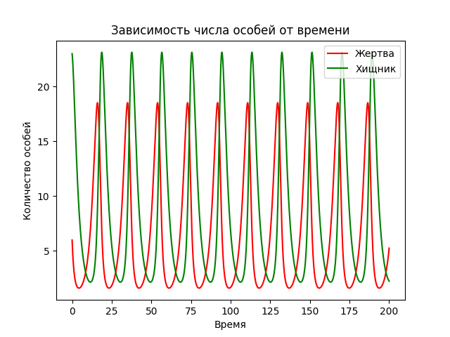

---
# Front matter
lang: ru-RU
title: "Лабораторная №4"
subtitle: "Модель хищник-жертва"
author: "Игнатьев Николай"

# Formatting
toc-title: "Содержание"
toc: true # Table of contents
toc_depth: 2
lof: false # List of figures
lot: false # List of tables
fontsize: 12pt
linestretch: 1.5
papersize: a4paper
documentclass: scrreprt
polyglossia-lang: russian
polyglossia-otherlangs: english
mainfont: PT Serif
romanfont: PT Serif
sansfont: PT Sans
monofont: PT Mono
mainfontoptions: Ligatures=TeX
romanfontoptions: Ligatures=TeX
sansfontoptions: Ligatures=TeX,Scale=MatchLowercase
monofontoptions: Scale=MatchLowercase
indent: true
pdf-engine: lualatex
header-includes:
  - \linepenalty=10 # the penalty added to the badness of each line within a paragraph (no associated penalty node) Increasing the value makes tex try to have fewer lines in the paragraph.
  - \interlinepenalty=0 # value of the penalty (node) added after each line of a paragraph.
  - \hyphenpenalty=50 # the penalty for line breaking at an automatically inserted hyphen
  - \exhyphenpenalty=50 # the penalty for line breaking at an explicit hyphen
  - \binoppenalty=700 # the penalty for breaking a line at a binary operator
  - \relpenalty=500 # the penalty for breaking a line at a relation
  - \clubpenalty=150 # extra penalty for breaking after first line of a paragraph
  - \widowpenalty=150 # extra penalty for breaking before last line of a paragraph
  - \displaywidowpenalty=50 # extra penalty for breaking before last line before a display math
  - \brokenpenalty=100 # extra penalty for page breaking after a hyphenated line
  - \predisplaypenalty=10000 # penalty for breaking before a display
  - \postdisplaypenalty=0 # penalty for breaking after a display
  - \floatingpenalty = 20000 # penalty for splitting an insertion (can only be split footnote in standard LaTeX)
  - \raggedbottom # or \flushbottom
  - \usepackage{float} # keep figures where there are in the text
  - \floatplacement{figure}{H} # keep figures where there are in the text
---

# Цель работы
Изучить простейшую модель хищник жертва. Найти стационарное состояние.

# Задание
Для модели «хищник-жертва»:
$$ \frac{dx}{dt} = -0.38x(t) + 0.043x(t)y(t) $$
$$ \frac{dy}{dt} = 0.36y(t) - 0.052x(t)y(t) $$
Построить график зависимости численности хищников от численности жертв,
а также графики изменения численности хищников и численности жертв при
следующих начальных условиях: $ x_0 = 6$, $y_0 = 23 $. Найти стационарное состояние системы.

# Выполнение лабораторной работы
На графике изображены "кольца" состояний, самое внешнее относится к начальным условиям.
Так-же была вычислена стационарная точка по формуле $x_s = c / d$, $y_s = a / b$, она изображена в центре.

Также можно посмотреть как внешняя кривая выглядят на графике количества особей.

# Выводы
Была построена модель хищник-жертва, а также было изучено её стационарное состояние и проанализирована зависимость числа особей от времени.
